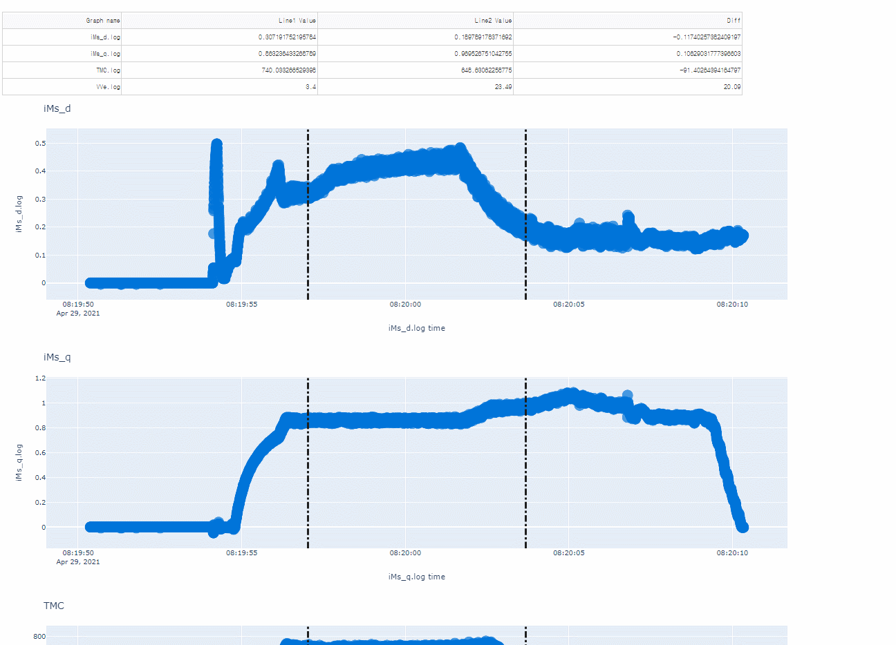

# **Traction converter Log Data Visualization**

## Description

  This Plotly Dash application is built for Traction converter log data visualization. 
 which facilitates the analysis and troubleshoot of time series values collected 
 from different signals generated by a traction converter application(written in MATLAB). 
 

## Feature

-  Conversion from raw timestamp generatated in Matlab application to python's timestamp type

-  Find a scattered point that is closest to the location of a reference line just moved and relocate the line right on the point 

-  Synchronization of x and y axis movement, zoom in/out, and also the location of reference lines between each plot

-  Dynamic number of graphs rendered based on the number of signal log data

-  Panda DataFrame handling

## Limitation

 - Synchronization generally occurs with a time delay that varies in degree of the size of
a data set. 
   
